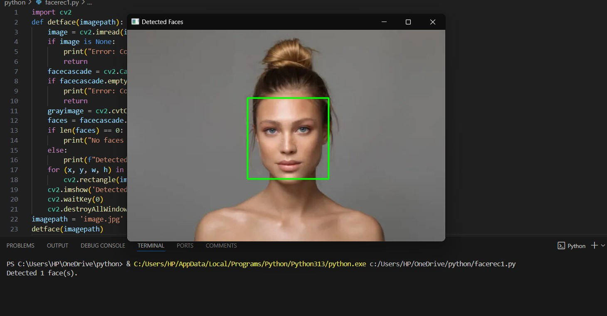

# Face Recognition in Python

This repository contains a Python script that performs face recognition using OpenCV and Haar Cascade Classifier. The script detects faces in an image and highlights them with bounding boxes.

## Features
- Detects faces in an image using OpenCV's pre-trained Haar Cascade Classifier.
- Draws bounding boxes around detected faces.
- Provides a simple and reusable function for face detection.

## Requirements
Make sure you have the following installed before running the script:
- Python 3.x
- OpenCV library (`pip install opencv-python`)
- An image file (e.g., `image.jpg`)

## Installation
Clone the repository:
- git clone https://github.com/MariamSkaria/face-recognition-python.git
-  cd face-recognition-python

## Prerequisites
1. Install Python 3.x: [Download Python](https://www.python.org/downloads/)
2. Install the required Python libraries:
- pip install opencv-python

## Displayed Image:
The image will show rectangles drawn around the detected faces.

## Notes
Ensure the input image file path is correct.

## For better results:
- Use high-resolution images with clearly visible faces.
- Adjust the scaleFactor and minNeighbors parameters of detectMultiScale if needed.

## License
This project is licensed under the GNU. Feel free to use, modify, and distribute.

## Contributing
Contributions are welcome! If you find bugs or want to improve the script, please submit a pull request.

